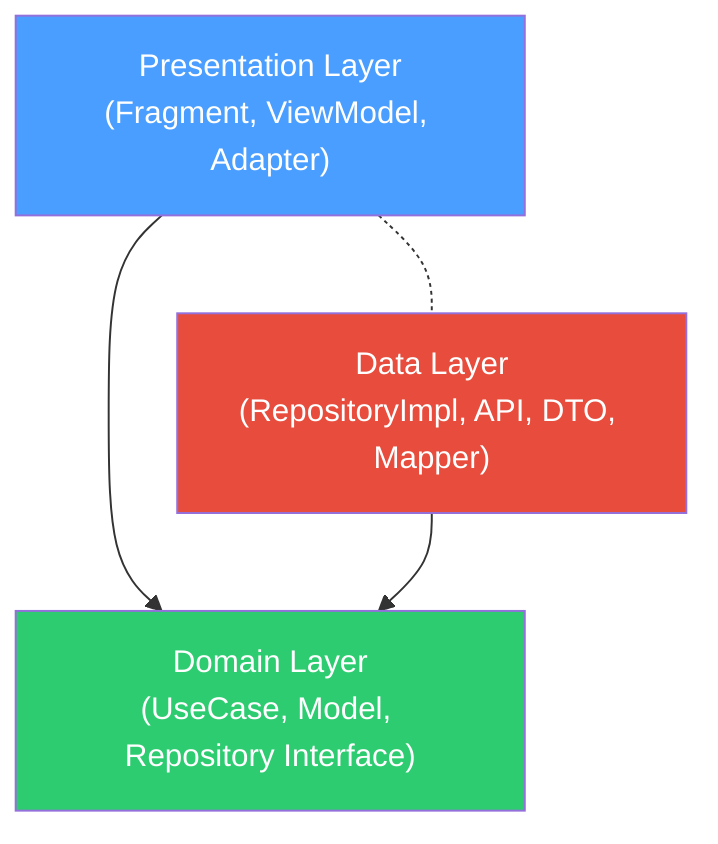

# S611 - 프로젝트 아키텍처 및 기술 스택 분석

## 1. 개요
S611은 Open Library API를 활용하여 전 세계 서적 정보를 검색하고 상세 정보를 확인할 수 있는 안드로이드 애플리케이션입니다.
본 프로젝트는 **Clean Architecture**와 **MVVM (Model-View-ViewModel)** 패턴을 기반으로 관심사를 분리하고 유지보수성을 극대화하는 방향으로 설계되었습니다.

## 2. 프로젝트 구조 (Clean Architecture)

```
app.peter.s611/
├── application/          # 앱 초기화 및 DI 설정
│   ├── di/
│   │   ├── annotation/   # @ActivityScope, @ViewModelKey
│   │   └── module/
│   │       ├── component/ # ApiModule, NetworkModule, RepositoryModule
│   │       └── view/      # ViewModelFactory, ViewModelModule
│   └── S611.kt, Log.kt, Utils.kt, DomainConst.kt
│
├── domain/               # 비즈니스 로직 계층 (순수 Kotlin)
│   ├── model/            # Domain 모델 (Book, DetailBook, ListBook)
│   ├── repository/       # Repository 인터페이스 (LibraryRepository)
│   └── usecase/          # UseCase (NewBook, Search, Detail, Bookmark)
│
├── data/                 # 데이터 계층 (Domain 인터페이스 구현)
│   ├── entities/         # API DTO (OLSearchResponse, OLEditionResponse 등)
│   └── repository/
│       ├── LibraryRepositoryImpl.kt  # Domain Repository 구현체
│       └── source/
│           ├── local/    # S611Data (인메모리 저장)
│           └── remote/   # Api 인터페이스, OLResponseMapper
│
└── presentation/         # UI 계층 (MVVM)
    ├── MainActivity.kt
    ├── MainViewModel.kt  # 앱 수준 (initClient, reviewManager)
    ├── book/             # NewBookFragment, NewBookViewModel, NewBookAdapter
    ├── search/           # SearchFragment, SearchViewModel, SearchAdapter
    ├── detail/           # DetailFragment, DetailViewModel
    ├── bookmark/         # BookmarkFragment, BookmarkViewModel, BookmarkAdapter
    ├── history/          # HistoryFragment, HistoryViewModel, HistoryAdapter
    ├── main/             # ViewPagerFragment, BookPagerAdapter
    └── data/             # UiConst (TabType, ItemType)
```

## 3. 의존성 방향 (DIP 적용)



- **Domain 계층**: 어떠한 외부 계층도 알지 못합니다. 순수 Kotlin + RxJava Single만 사용합니다.
- **Data 계층**: Domain 계층에 정의된 `LibraryRepository` 인터페이스를 `LibraryRepositoryImpl`이 구현합니다.
- **Presentation 계층**: Domain 계층의 UseCase와 Model만 사용하며, Data 계층에 직접 의존하지 않습니다.

## 4. ViewModel 분리 (SRP 적용)

| ViewModel | 책임 | 사용 Fragment |
|---|---|---|
| `MainViewModel` | 앱 수준 초기화 (AppSet, ReviewManager) | ViewPagerFragment, MainActivity |
| `NewBookViewModel` | 신간 도서 목록 + 페이지네이션 | NewBookFragment |
| `SearchViewModel` | 검색 + 페이지네이션 + 히스토리 관리 | SearchFragment |
| `DetailViewModel` | 도서 상세 조회 + 북마크 토글 | DetailFragment |
| `BookmarkViewModel` | 북마크 목록 조회/업데이트 | BookmarkFragment |
| `HistoryViewModel` | 검색 히스토리 조회 | HistoryFragment |

## 5. 주요 기술 스택

### ⚙️ 코어 & 아키텍처
* **언어**: Kotlin (JDK 17)
* **SDK 버전**: Min SDK 28 (Android 9), Target SDK 36 (Android 15)
* **아키텍처 패턴**: MVVM, Clean Architecture (with DIP)

### 🔗 비동기 및 네트워크 통신
* **비동기 처리**: RxJava3 (`rxkotlin`, `rxandroid`)
* **네트워크**: Retrofit 2.9.0 & OkHttp 4.9.1 (GSON 컨버터)

### 💉 의존성 주입 (DI)
* **Dagger 2** (`2.41`) - `@Binds` 패턴으로 Repository 인터페이스 바인딩

### 🖼️ UI 및 Jetpack
* ViewBinding, Navigation Component (`2.4.2`), ViewModel, LiveData (`2.4.1`)
* Glide 4.12.0

## 6. 리팩토링 이력

### v1 주요 개선 사항

#### Fix 1: RxJava 메모리 누수 해결
- 모든 ViewModel에서 `onCleared()` 시 `disposable.clear()` 호출

#### Fix 2: Fragment ViewBinding 메모리 누수 해결
- 모든 Fragment에 nullable `_binding` 패턴 + `onDestroyView()`에서 null 해제

#### Fix 3: 검색 페이지네이션 상태의 ViewModel 이동
- Fragment 로컬 변수 → ViewModel로 이동하여 구성 변경(Configuration Change) 시에도 상태 보존

#### Fix 4: ViewModel 스코핑 통합
- `ViewModelProvider(this, ...)` → `ViewModelProvider(requireActivity(), ...)` 통일

#### Fix 5: ViewModel 분리 (SRP)
- 단일 `MainViewModel` → 6개의 책임별 ViewModel로 분리

#### Fix 6: Domain 계층 의존성 역전 (DIP)
- Domain 모델(`domain/model/`) 및 Repository 인터페이스(`domain/repository/`) 도입
- UseCase가 Data 구현체가 아닌 Domain 인터페이스에만 의존
- RepositoryModule을 `@Binds` 패턴으로 변경하여 인터페이스-구현체 바인딩

### 향후 개선 과제
- **로컬 데이터 영속화**: 메모리 기반(`ArrayList`) 북마크/히스토리를 Room Database 또는 DataStore로 마이그레이션
- **RxJava3 → Coroutines/Flow 전환**: `viewModelScope`를 활용한 생명주기 안전 비동기 처리
- **Dead Code 정리**: `data/entities/Book.kt`, `DetailBook.kt`, `ListBook.kt` (Domain 모델로 대체되어 미사용)
